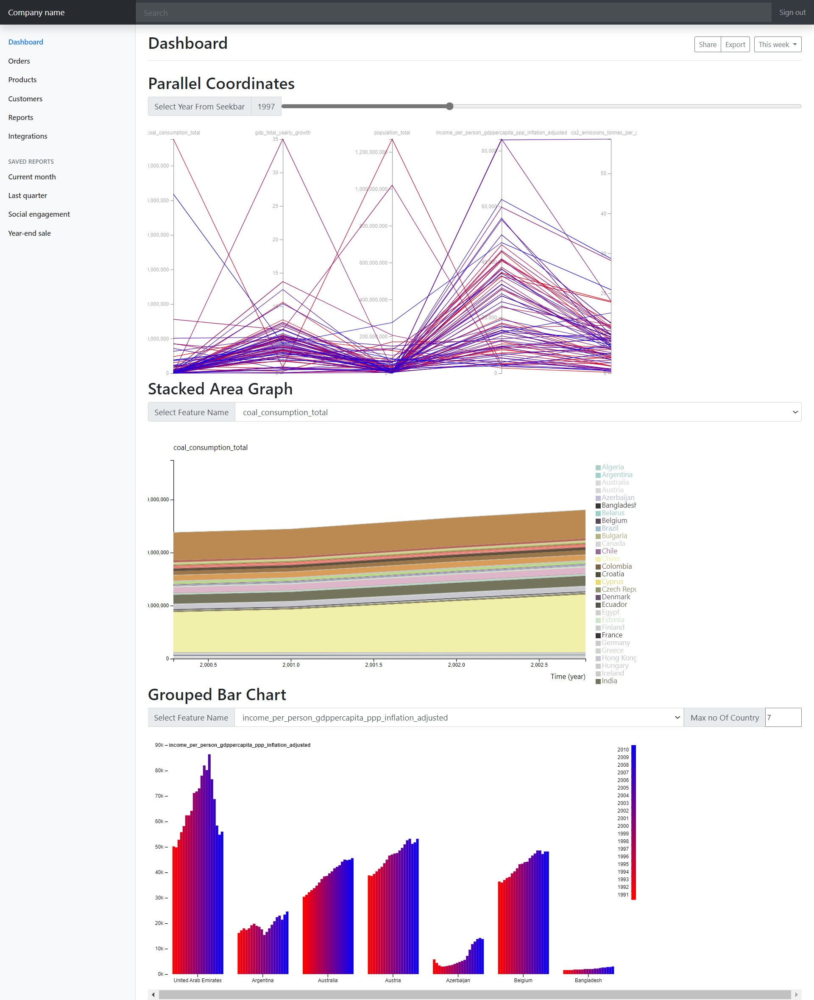

# Data Visualization with D3js v4

## Work description-

1. Extract data from https://www.gapminder.org/data/ to construct a d-dimensional (d  5) dataset. In this dataset, countries or regions are individual data points. Each data point will have d number of attributes which come from https://www.gapminder.org/data/. You need to clean the dataset to ensure consistencies. For example, all attributes should come from roughly the same time period, and missing data should be avoided or lled. The selection of attributes to download should be based on some interesting ideas or hypothesis that you are trying to demonstrate or conrm.
2. Use D3 to visualize your d-dimensional dataset with 3 dierent multi-dimensional data visualization techniques that D3 provides: Scatterplot Matrix, Parallel Coordinate, and Streamgraph. You will need to provide some interactive functions in each of these visualizations, and they should reveal dierent aspects of the data to demonstrate your hypothesis or insight.
3. Write a description about what insight you gain from these visualizations: discovery, revelation, surprises, etc.

## Data

* Data is stored in [here](./raw-data)
* Data is cleaned by Python script (can be found in [here](./data_cleaning)) and cleaned data is stored in [here](./cleaned_data).
* Visualization Code can be found in [here](./visualization).

### Python Environment Setup

## Install conda package command-

```console
conda env remove -n Offline1 -y
#conda env create -f environment.yml
conda env update --file environment.yml
activate Offline1
#deactivate
```
And then activate the `Offline1` environment for the code.

## Visual of the page is like this-



## Report-

Report can be found in [here](./Report.pdf).